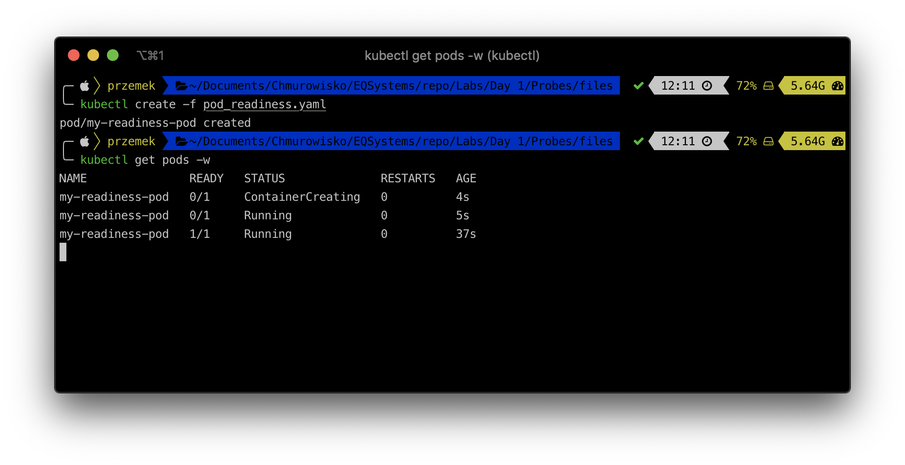

<br><br>
<br><br>
<br><br>

# Creating pods with liveness and readiness probes

## LAB Overview

#### In this lab you will create a Kubernetes pod with Liveness and Readiness probes

## Task 1: Creating a pod with a liveness probe


1. Create new file by typing ```nano pod_liveness.yaml```.

2. Download [manifest file](./files/pod_liveness.yaml) and paste its content into editor.

3. Save changes by pressing *CTRL+O* and *CTRL-X*.

4. Type ```kubectl create -f pod_liveness.yaml``` and press enter.

5. Check if there is a pod created by typing ```kubectl get pods```.


6. Check wheter or not the **STATUS** field is set to *Running*. If so, the liveness probe has passed.

7. Delete the pod using ```kubectl delete pod my-liveness-pod --grace-period=1``` command.

The example of manifest

```yaml
cat <<EOF | kubectl -n default apply -f -
---
apiVersion: v1
kind: Pod
metadata:
  name: my-liveness-pod
  labels:
    app: myapp
spec:
  containers:
  - name: myapp-container
    image: busybox
    command: ['sh', '-c', 'echo Welcome to Kubernetes! && sleep 3600']
    livenessProbe:
      exec:
        command:
        - echo
        - testing pod liveness
      initialDelaySeconds: 5
      periodSeconds: 5
EOF    
```


## Task 2: Creating pod with readiness probe.


1. Create new file by typing ```nano pod_readiness.yaml```.

2. Download [manifest file](./files/pod_readiness.yaml) and paste its content into editor.

3. Save changes by pressing *CTRL+O* and *CTRL-X*.

4. Type ```kubectl create -f pod_readiness.yaml``` and press enter.

5. Check if there is a pod created by typing ```kubectl get pods```.

6. Check wheter or not the **READY** field is set to *1/1*. If so, the readinessness probe has passed.

7. Delete the pod using ```kubectl delete pod my-readiness-pod --grace-period=1``` command

8. Edit the manifest file by executing command ```nano pod_readiness.yaml```.

9. Change initialDelaySeconds to *30* and save the file.

10. Check pod status using following command: ```kubectl get pods -w ```. Compare **STATUS** and **READY 
FIELD**. Wait for pod to be ready.



11. Press **CTRL+C**.

12. Delete the pod using ```kubectl delete pod my-readiness-pod --grace-period=1``` command.


The example of manifest

```yaml
cat <<EOF | kubectl -n default apply -f -
---
apiVersion: v1
kind: Pod
metadata:
  name: my-readiness-pod
spec:
  containers:
  - name: myapp-container
    image: nginx
    readinessProbe:
      httpGet:
        path: /
        port: 80
      initialDelaySeconds: 5
      periodSeconds: 5
EOF    
```


## END LAB

<br><br>

<center><p>&copy; 2021 Chmurowisko Sp. z o.o.<p></center>
