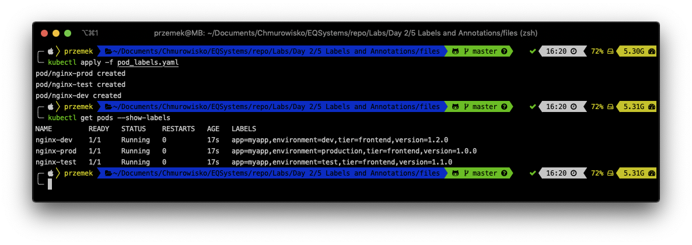
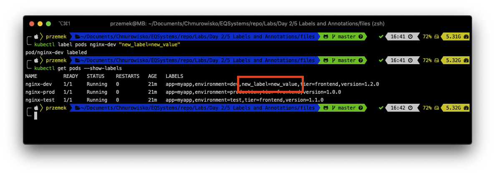
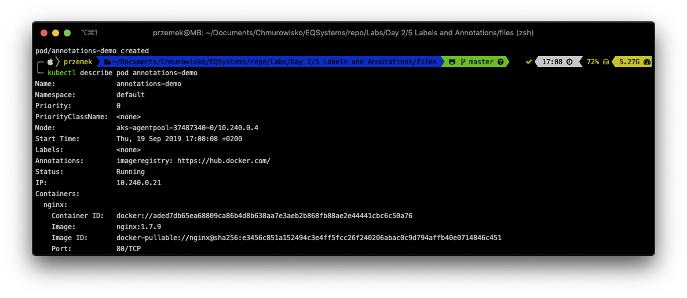

<br><br>
<br><br>
<br><br>

# Labels and Annotations

## LAB Overview

#### In this lab you will work with Labels and Annotations

* *Labels* provide identifying metadata for objects. These are fundamental qualities of the object that will be used for grouping, viewing, and operating.
* *Annotations* provide a place to store additional metadata for Kubernetes objects with the sole purpose of assisting tools and libraries.

## Task 1: Creating Pods with labels 

1. Create new file by typing ```nano pod_labels.yaml```.

2. Download [manifest file](./files/pod_labels.yaml) and paste its content into editor.

3. Save changes by pressing *CTRL+O* and *CTRL-X*.

4. Type ```kubectl create -f pod_labels.yaml``` and press enter.

5. Check if there is a pod created by typing ```kubectl get pods --show-labels```.



## Task 2: Modifying labels

Labels can also be applied (or updated) on objects after they are created.

1. Add a label to one of the pods using following command:

```kubectl label pods <-NAME-OF-THE-POD-> "new_label=new_value"```

kubectl label pods nginx-dev "new_label=new_value"
and examine labels once again:
```kubectl get pods --show-labels```




2. Remove a label by executing command:

```kubectl label pod <-NAME-OF-THE-POD-> "new_label-"```

The label should disappear


## Task 3: Label selectors

Label selectors are used to filter Kubernetes objects based on a set of labels.

1. Select only *production* version of your pods using following command:
```
kubectl get pods --selector="environment=production" --show-labels
```
You should get only one Pod.


2. Select Pods running in both production and testing environment:

```kubectl get pods --selector="environment in (production, test)" --show-labels```

or

```kubectl get pods --selector="environment!=dev" --show-labels```


3. You can try using different selectors:

* key=value
* key!=value
* key in (value1, value2) 
* key notin (value1, value2) key
* !key

4. Delete pods:

```kubectl delete -f pod_labels.yaml```

## Task 4. Annotations

1. Create new file by typing ``nano pod_annotation.yaml``.

2. Download [manifest file](./files/pod_annotation.yaml) and paste its content into editor.

3. Save changes by pressing *CTRL+O* and *CTRL-X*.

4. Type ```kubectl create -f pod_annotation.yaml``` and press enter.

5. Get the description of the pod:

```kubectl describe pod annotations-demo```



## END LAB

<br><br>

<center><p>&copy; 2021 Chmurowisko Sp. z o.o.<p></center>
