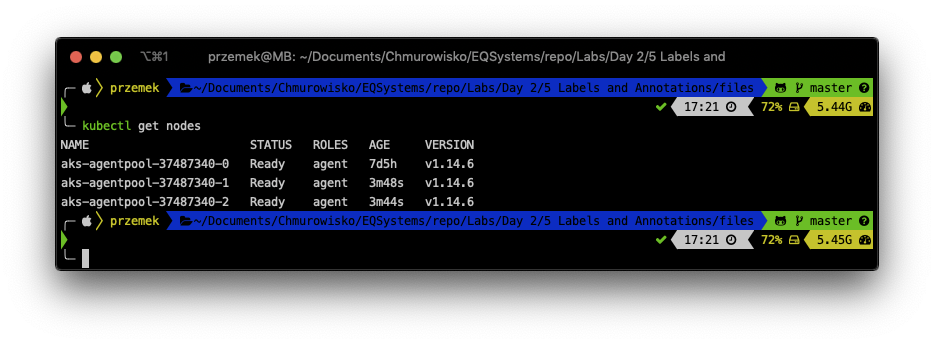
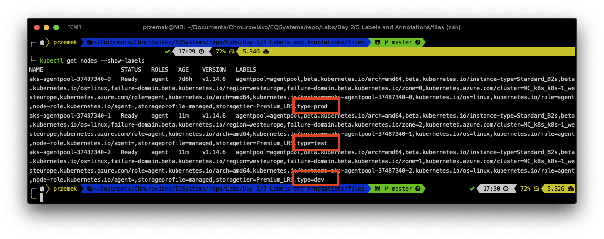

<br><br>
<br><br>
<br><br>

# Working with NodeSelectors

## LAB Overview

#### In this lab you will work with Pods using NodeSelectors

## Task 1: Adding labels to cluster nodes

1. For this lab you need at least two nodes. To check if there are any nodes available, type ```kubectl get nodes``` and press **Enter**.
You should get at least two nodes.

Please write down all node names.

2. Add labels to all your nodes using following command:

```kubectl label nodes <node-name> <label-key>=<label-value>```

Set label **type** to three different values, i.e.
* ```kubectl label nodes aks-agentpool-37487340-0 type=prod```
* ```kubectl label nodes aks-agentpool-37487340-1 type=test```
* ```kubectl label nodes aks-agentpool-37487340-2 type=dev```

3. Verify the labels by running:

```kubectl get nodes --show-labels```



## Task 2: Creating ReplicaSet of nginx Pods

1. Create new file by typing ```nano replica_set.yaml```.

2. Download [manifest file](./files/replica_set.yaml) and paste its content into editor.

3. Save changes by pressing *CTRL+O* and *CTRL-X*.

4. Type ```kubectl create -f replica_set.yaml``` and press enter.

5. Get the list of pods by tunning:

```kubectl get pods -o wide```

All pods are spread across all nodes


The example of manifest

```yaml
cat <<EOF | kubectl -n default apply -f -
---
apiVersion: apps/v1
kind: ReplicaSet
metadata:
  name: frontend
  labels:
    app: frontend
spec:
  replicas: 3
  selector:
    matchLabels:
      app: frontend
  template:
    metadata:
      labels:
        app: frontend
    spec:
      containers:
      - name: frontend
        image: "nginx:1.20.0"   
EOF
```

## Task 3: Creating ReplicaSet of nginx Pods on prod node

1. Create new file by typing ```nano replica_set_node_selector.yaml```.

2. Download [manifest file](./files/replica_set_node_selector.yaml) and paste its content into editor.

3. Save changes by pressing *CTRL+O* and *CTRL-X*.

4. Type ```kubectl create -f replica_set_node_selector.yaml``` and press enter.

5. Get the list of pods by tunning:

```kubectl get pods -o wide```

Now, all three pods are running on *prod* node.


6. Please delete ReplicaSets by running:

```
kubectl delete -f replica_set.yaml 
kubectl delete -f replica_set_node_selector.yaml
```

The example of manifest

```yaml
cat <<EOF | kubectl -n default apply -f -
apiVersion: apps/v1
kind: ReplicaSet
metadata:
  name: frontend-selector
spec:
  replicas: 3
  selector:
    matchLabels:
      app: frontend
  template:
    metadata:
      labels:
        app: frontend
    spec:
      containers:
        - name: frontend
          image: "nginx:1.20.0"
      nodeSelector:
        type: prod
EOF
```


## END LAB

<br><br>

<center><p>&copy; 2021 Chmurowisko Sp. z o.o.<p></center>
