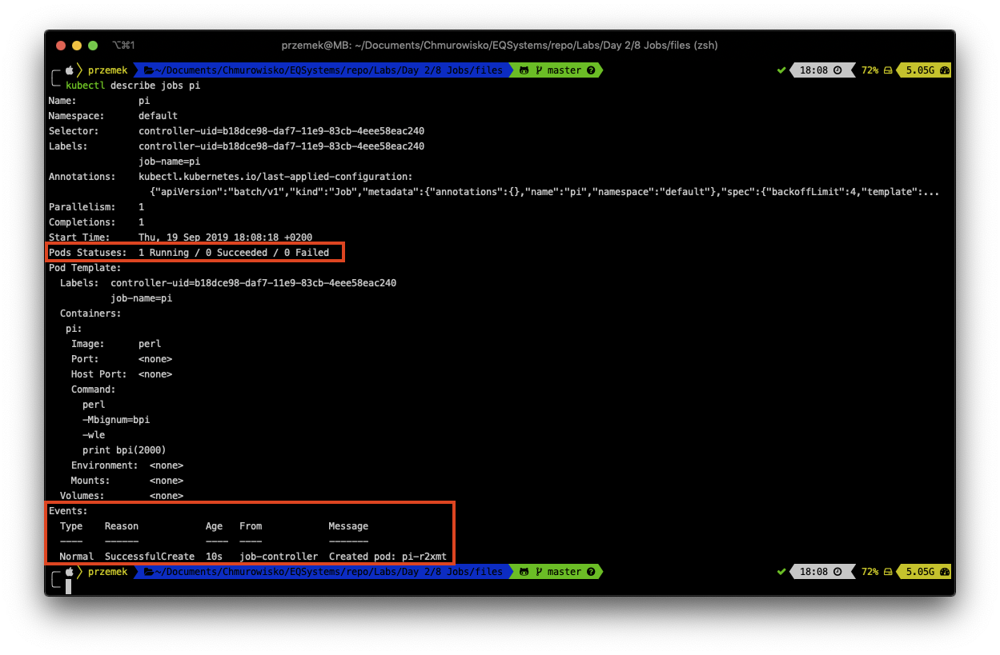
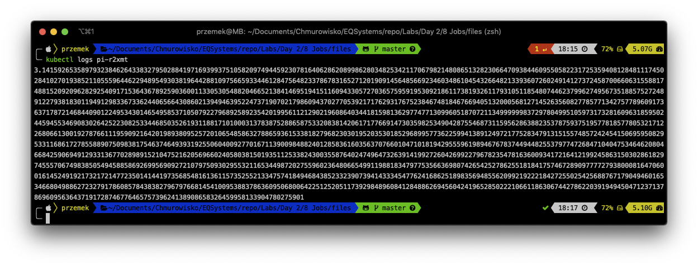
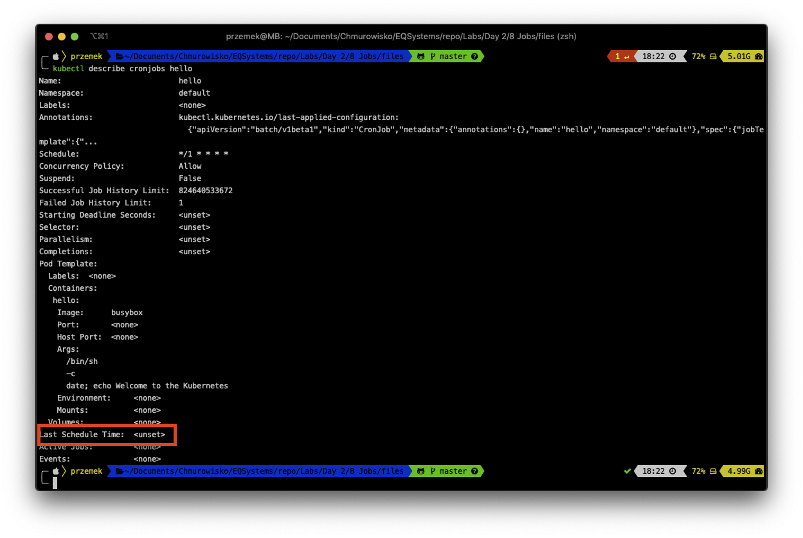
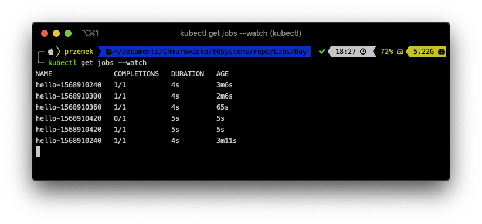
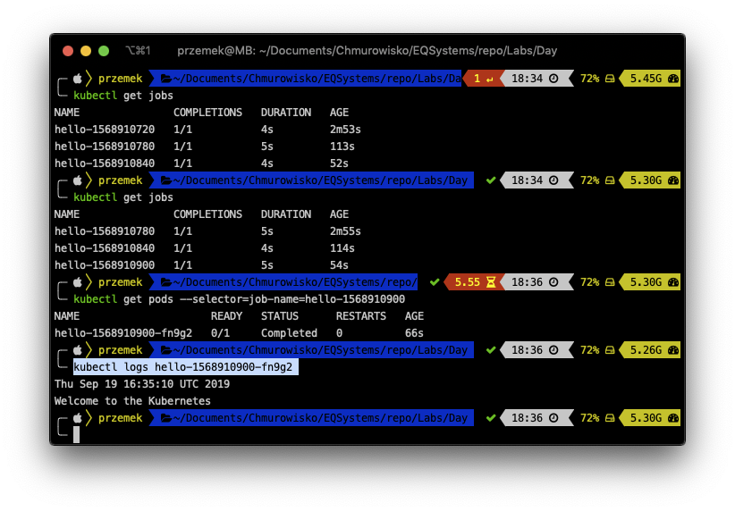

<br><br>
<br><br>
<br><br>

# Jobs

## LAB Overview

#### In this lab you will work with Jobs

A Job creates one or more Pods and ensures that a specified number of them successfully terminate

## Task 1: Creating a Job

In this task you will create a job that counts *pi* numbers.

1. Create new file by typing ```nano job_pi.yaml```.

2. Download [manifest file](./files/job_pi.yaml) and paste its content into editor.

3. Save changes by pressing *CTRL+O* and *CTRL-X*.

4. Type ```kubectl apply -f job_pi.yaml``` and press enter.

5. Check on the status of the Job running:

```kubectl describe jobs pi```

As you can see, the Job has one event and is still running


6. After a while Job finishes


## Task 2: Examinig results

1. To list all the Pods that belong to a Job run:

```kubectl get pods --selector=job-name=pi```

2. To get the result of Job you eed to display Pod's logs:

```kubectl logs <-YOUR-POD-NAME>```



3. Please delete the Job:

```kubectl delete job pi```

## Task 3: Creating CronJob

1. Create new file by typing ``nano job_cron.yaml``.

2. Download [manifest file](./files/job_cron.yaml) and paste its content into editor.

3. Save changes by pressing *CTRL+O* and *CTRL-X*.

4. Type ```kubectl apply -f job_cron.yaml``` and press enter.

5. Check the staatus of the job:

```kubectl describe cronjobs hello```



As you can see, the *Last Schedule Time* is unset.

6. Wait a minute and run following command:

```kubectl get cronjob hello```

Now you can see **LAST SCHEDULE**


7. You can also watch the status of the Jobs:

```kubectl get jobs --watch```



## Task 4: Examine the logs of your Job's Pod

1. List the jobs by running:

```kubectl get jobs```


2. Copy the name of the youngest Job and tet pods for the Job.

```kubectl get pods --selector=job-name=<-YOUR-JOB-NAME->```

3. Finally, copy the Pod name and read its logs:

```kubectl logs <-YOUR-POD-NAME->```



4. Please delete the CronJob:

```kubectl delete cronjob hello```

## END LAB

<br><br>

<center><p>&copy; 2019 Chmurowisko Sp. z o.o.<p></center>
