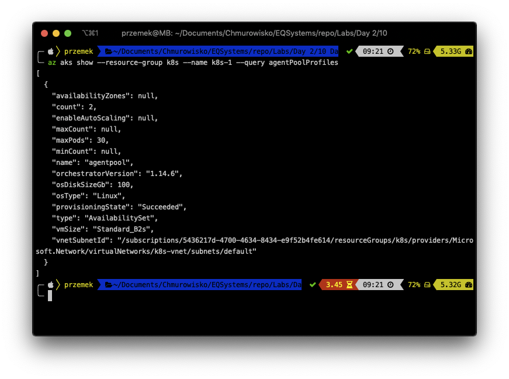
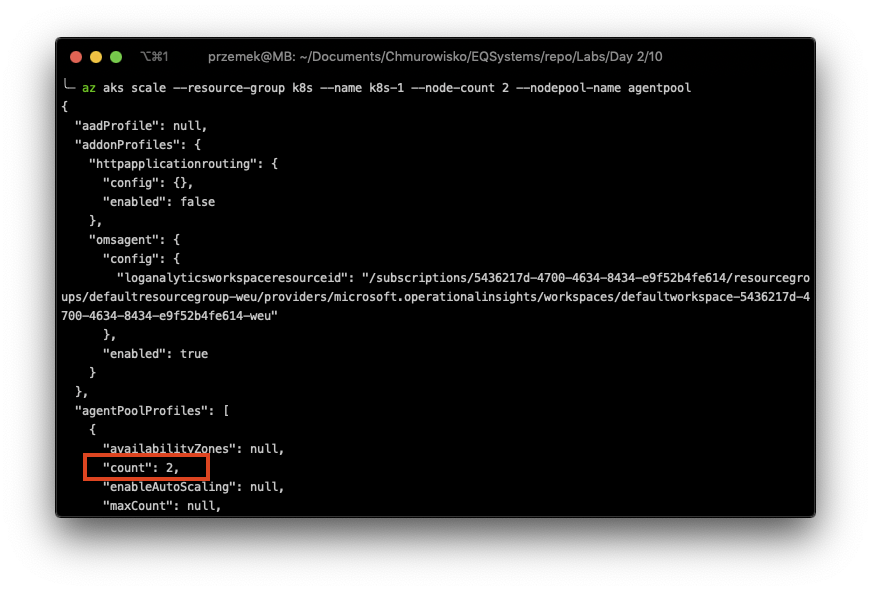
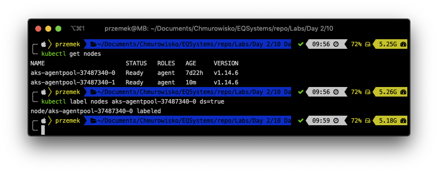

<br><br>
<br><br>
<br><br>

# DaemonSets

## LAB Overview

#### In this lab you will work with DaemonSets

A DaemonSet ensures a copy of a Pod is running across a set of nodes in a Kuber‐ netes cluster. DaemonSets are used to deploy system daemons such as log collectors and monitoring agents, which typically must run on every node.

## Task 1: Scale your Kubernetes cluster

For this lab you need more than one node in your cluster.

1. First, get the name of your node pool:

```az aks show --resource-group myResourceGroup --name myAKSCluster --query agentPoolProfiles```

Replace *myResourceGroup* and *myAKSCluster* with your values and execute command.



2. Using following command:

```az aks scale --resource-group myResourceGroup --name myAKSCluster --node-count 2 --nodepool-name <your node pool name>``` 

scale the cluster. Of course replace *myResourceGroup*, *myAKSCluster* and *<your node pool name>* with your values.


## Task 2: Creating a DeamonSet

1. Create new file by typing ```nano ds.yaml```.

2. Download [manifest file](./files/ds.yaml) and paste its content into editor.

3. Save changes by pressing *CTRL+O* and *CTRL-X*.

4. Type ```kubectl apply -f ds.yaml``` and press enter.

5. Get the list of running DaemonSets: ```kubectl get daemonsets```


and describe the DaemonSet: ```kubectl describe daemonset daemonset```

As you can see the Pods was successfully deployed to all two nodes in our cluster. 


The example of manifest

```yaml
cat <<EOF | kubectl -n default apply -f -
---
apiVersion: apps/v1
kind: DaemonSet
metadata:
  name: daemonset
  labels:
    app: fluentd
spec:
  selector:
    matchLabels:
      app: fluentd
  template:
    metadata:
      labels:
        app: fluentd
    spec:
      containers:
      - name: fluentd
        image: fluent/fluentd:v0.14.10
        resources:
          limits:
            memory: 200Mi
          requests:
            cpu: 100m
            memory: 200Mi
        volumeMounts:
        - name: varlog
          mountPath: /var/log
        - name: varlibdockercontainers
          mountPath: /var/lib/docker/containers
          readOnly: true
      terminationGracePeriodSeconds: 30
      volumes:
      - name: varlog
        hostPath:
          path: /var/log
      - name: varlibdockercontainers
        hostPath:
          path: /var/lib/docker/containers
EOF
```


## Task 3: Limiting DaemonSets to Specific Nodes

1. Get the list of your nodes:

```kubectl get nodes```

and add node labels to one of them:

```kubectl label nodes <-YOUR-NODE-NAME-> ds=true```

As always, replace <-YOUR-NODE-NAME-> with your value (the name of one of your nodes).



2. Create new file by typing ```nano ds_select.yaml```.

3. Download [manifest file](./files/ds_select.yaml) and paste its content into editor.

4. Save changes by pressing *CTRL+O* and *CTRL-X*.

5. Type ```kubectl apply -f ds_select.yaml``` and press enter.

6. Describe the daemonset: ```kubectl describe daemonset nginx-ds```


The Pod is now applied to only one of the nodes.

7. Get the list of Pods:

```kubectl get pods -o wide```

You should have two Pods running on one of your nodes and one on the second one.

8. Please delete both DaemonSets:

```kubectl delete -f ds_select.yaml
kubectl delete -f ds.yaml
```

and rescale your cluster to one node:

```az aks scale --resource-group myResourceGroup --name myAKSCluster --node-count 1 --nodepool-name <your node pool name>``` 

Of course replace *myResourceGroup*, *myAKSCluster* and *<your node pool name>* with your values.


The example of manifest

```yaml
cat <<EOF | kubectl -n default apply -f -
---
apiVersion: apps/v1
kind: DaemonSet
metadata:
  labels:
    app: nginx
    ssd: "true"
  name: nginx-ds
spec:
  selector:
    matchLabels:
      app: nginx
  template:
    metadata:
      labels:
        app: nginx
        ssd: "true"
    spec:
      nodeSelector:
        ds: "true"
      containers:
        - name: nginx
          image: nginx:1.17.3
EOF
```


## END LAB

<br><br>

<center><p>&copy; 2021 Chmurowisko Sp. z o.o.<p></center>
