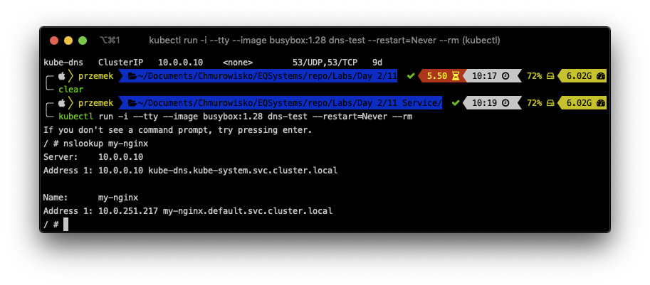
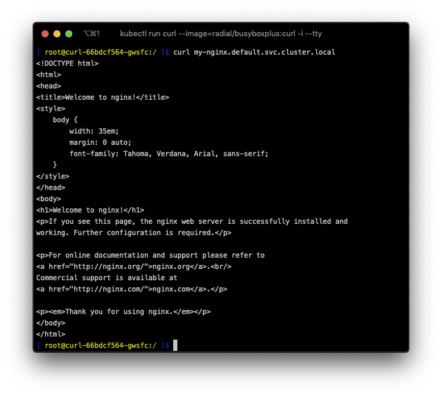
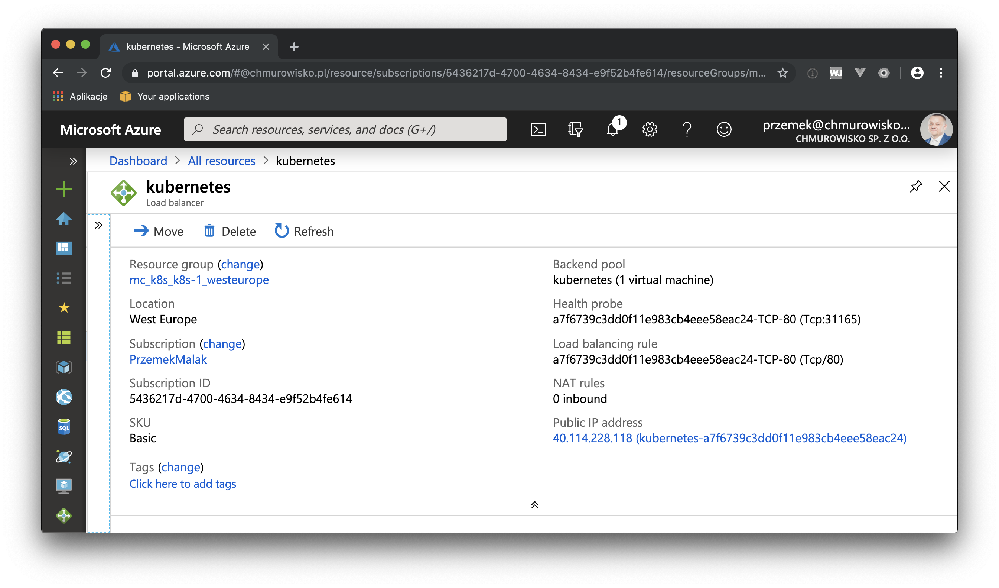
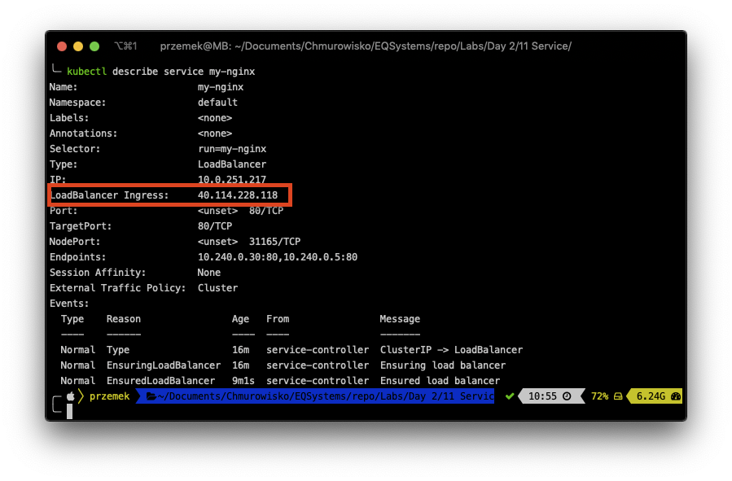

<br><br>
<br><br>
<br><br>

# Service

## LAB Overview

#### In this lab you will work with Services

An abstract way to expose an application running on a set of Pods as a network service.

## Task 1: Creating a Deployment

Create an nginx Pod, and note that it has a container port specification.

1. Create new file by typing ```nano depl.yaml```.

2. Download [manifest file](./files/depl.yaml) and paste its content into editor.

3. Save changes by pressing *CTRL+O* and *CTRL-X*.

4. Type ```kubectl apply -f depl.yaml``` and press enter.

5. Get the list of running Pods:

```
kubectl get pods -l run=my-nginx -o wide
```
and their IPs:
```
kubectl get pods -l run=my-nginx -o yaml | grep podIP
```


The example of manifest

```yaml
cat <<EOF | kubectl -n default apply -f -
---
apiVersion: apps/v1
kind: Deployment
metadata:
  name: my-nginx
spec:
  selector:
    matchLabels:
      run: my-nginx
  replicas: 2
  template:
    metadata:
      labels:
        run: my-nginx
    spec:
      containers:
      - name: my-nginx
        image: nginx
        ports:
        - containerPort: 80
EOF
```


## Task 2: Creating Service

1. Create *Service* running following command:

```kubectl expose deployment my-nginx```

Instead, you can download [a manifest file](./files/service.yaml) and apply it using ```kubectl apply -f service.yaml```.

You created a Service which targets TCP port 80 on any Pod with the run: my-nginx label, and expose it on an abstracted Service port (targetPort: is the port the container accepts traffic on, port: is the abstracted Service port, which can be any port other pods use to access the Service)

2. Check the service: ```kubectl get service my-nginx```


A Service is backed by a group of Pods. These Pods are exposed through endpoints. The Service’s selector will be evaluated continuously and the results will be POSTed to an Endpoints object also named my-nginx

3. Check the endpoints, and note that the IPs are the same as the Pods created in the first step: 

```kubectl describe svc my-nginx ```


The example of manifest

```yaml
cat <<EOF | kubectl -n default apply -f -
---
apiVersion: v1
kind: Service
metadata:
  name: my-nginx
  labels:
    run: my-nginx
spec:
  ports:
  - port: 80
    protocol: TCP
  selector:
    run: my-nginx
EOF
```


## Task 3: Accessing the Service from within the cluster using DNS

1. Check if DNS is running on the clustert: 
```kubectl get services kube-dns --namespace=kube-system```


2. Use *kubectl run* to execute a container that provides the nslookup command from the dnsutils package:

```kubectl run curl --image=radial/busyboxplus:curl -i --tty --rm```

3. Inside the container run: ```nslookup my-nginx```


4. Still inside the container try getting data from *my-nginx* service:
```curl my-nginx.default.svc.cluster.local```



## Task 4: Exposing the Service

Kubernetes supports two ways of doing this: *NodePorts* and *LoadBalancers*. You'll create a load balancer.

1. Run ```kubectl edit svc my-nginx``` and set type to **LoadBalancer**. Save changes.


2. Run ```kubectl get svc my-nginx -w``` and wait for **EXTERNAL-IP


3. Using any browser og your choice, navigate to **EXTERNAL-IP** address


Your service is now exposed to the world. There was a Load Balancer created automatically.



4. Describe the service: ```kubectl describe service my-nginx```



there, you also have your Load Balances Ingress IP.

5. Please, delete the service:

```kubectl delete service my-nginx```

and deployment
```kubectl delete deployment my-nginx```

## END LAB

<br><br>

<center><p>&copy; 2021 Chmurowisko Sp. z o.o.<p></center>
