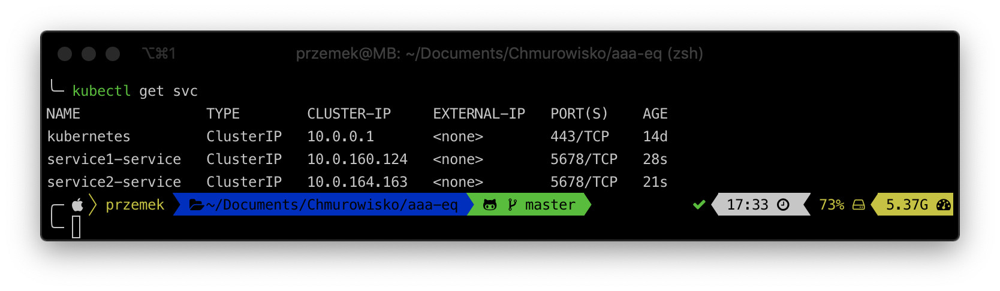

<br><br>
<br><br>
<br><br>

# Ingress

## LAB Overview

#### In this lab you will work with Ingress

During this lab you will manually install NGINX Ingress Controller.

## Task1: Creating Ingress Controller anc LoadBalancer

1. Create a new file by running ```nano mandatory.yaml```.

2. Download [manifest file](./files/mandatory.yaml) and paste its contents to editor window.

3. Save changes by pressing *CTRL+O* and *CTRL-X*.

4. Run: ```kubectl apply -f mandatory.yaml```

5. Create a new file by running ```nano cloud-generic.yaml```.

2. Download [manifest file](./files/cloud-generic.yaml) and paste its contents to editor window.

3. Save changes by pressing *CTRL+O* and *CTRL-X*.

4. Run: ```kubectl apply -f cloud-generic.yaml```

You should have a load balancer deployed now. Please check if it's ready.


## Task 2. Creating services

1. Create a new file by running ```nano service1.yaml```.

2. Download [manifest file](./files/service1.yaml) and paste its contents to editor window.

3. Save changes by pressing *CTRL+O* and *CTRL-X*.

4. Run: ```kubectl apply -f service1.yaml```

5. Create a new file by running ```nano service2.yaml```.

6. Download [manifest file](./files/service2.yaml) and paste its contents to editor window.

7. Save changes by pressing *CTRL+O* and *CTRL-X*.

8. Run: ```kubectl apply -f service2.yaml```

You should have two services now




The example of manifest

```yaml
cat <<EOF | kubectl -n default apply -f -
---
kind: Pod
apiVersion: v1
metadata:
  name: service1-app
  labels:
    app: service1
spec:
  containers:
    - name: service1-app
      image: hashicorp/http-echo
      args:
        - "-text=service1"

---

kind: Service
apiVersion: v1
metadata:
  name: service1-service
spec:
  selector:
    app: service1
  ports:
    - port: 5678 # Default port for image
EOF
```


## Task 3: Creating Ingress object

1. Create a new file by running ```nano ingress.yaml```.

2. Download [manifest file](./files/ingress.yaml) and paste its contents to editor window.

3. Save changes by pressing *CTRL+O* and *CTRL-X*.

4. Run: ```kubectl apply -f ingress.yaml```

## Task 4: Examinig the solution

1. Find your load balancer public IP.


2. Using any browser of your choice or *curl* open following urls:

* <YOUR-LOAD-BALANCER-IP>/srv1

* <YOUR-LOAD-BALANCER-IP>/srv2

You should get different responses from both services you deployed in task 3.

3. Please delete all objects:

* ```kubectl delete -f ingress.yaml```
* ```kubectl delete -f service2.yaml```
* ```kubectl delete -f service1.yaml```
* ```kubectl delete -f cloud-generic.yaml```
* ```kubectl delete -f mandatory.yaml```


The example of manifest

```yaml
cat <<EOF | kubectl -n default apply -f -
---
apiVersion: networking.k8s.io/v1
kind: Ingress
metadata:
  name: ingress
  annotations:
    nginx.ingress.kubernetes.io/ssl-redirect: "false"
    nginx.ingress.kubernetes.io/force-ssl-redirect: "false"
    nginx.ingress.kubernetes.io/rewrite-target: /
spec:
  tls:
  - hosts:
    - chmurowisko.pl
    secretName: tls-secret
  rules:
#  - host: chmurowisko.pl
   - http:
      paths:
        - path: /srv1
          pathType: Prefix
          backend:
            service: 
              name: service1-service
              port: 
                number: 5678
        - path: /srv2
          pathType: Prefix
          backend:
            service:
              name: service2-service
              port: 
                number: 5678
EOF
```


## END LAB

<br><br>

<center><p>&copy; 2021 Chmurowisko Sp. z o.o.<p></center>
