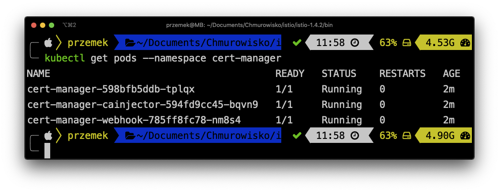
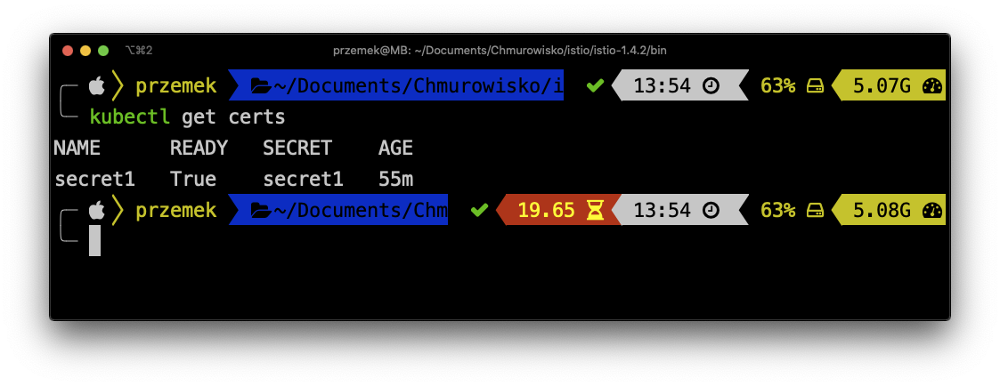

<br><br>
<br><br>
<br><br>

# TSL

## LAB Overview

#### In this lab you will create TSL certificate


## Task1: Creating an nginx controller

**This step is necessary only if you haven't deployed nginx ingress controller yet!!!**

1. Download [ingress manifest file](files/1_ingress_nginx.yaml).

2. Execute following command:

```kubectl apply -f 1_ingress_nginx.yaml```

3. Check if everything went fine by running:

```kubectl get svc -n ingress-nginx```

There should be a service of type *LoadBalancer* created for you. Please copy the *EXTERNAL-IP* of the service.


## Task 2: Creating nginx deployment

1. Download [nginx manifest file](files/2_deployment.yaml).

2. Run following command to deploy *nginx*

```kubectl apply -f 2_deployment.yaml```

Now, you should have your *nginx* up and running.

## Task 3: Creating ingress for nginx deployment

1. Download [ingress manifest file](files/3_simple_ingress.yaml).

2. Execute following command to deploy ingress for your *nginx* service:

```kubectl apply -f 3_simple_ingress.yaml```

3. Using any browser of your choise open *http://<EXTERNAL-IP-OF-YOUR-INGRESS>*


## Task 4: Adding *cert manager*.

1. Create a namespace for the *cert-manager* by execuing following command:

```kubectl create namespace cert-manager```

2. Instal the *cert-manager* by executing:

```kubectl apply --validate=false -f https://github.com/jetstack/cert-manager/releases/download/v0.12.0/cert-manager.yaml```

3. Verify the installation by executing:

```kubectl get pods --namespace cert-manager```



You should see the cert-manager, cert-manager-cainjector, and cert-manager-webhook pod in a Running state.

## Task 4: Configure the *cert-manager* for using *Let's Encrypt* issuer.

1. Download [manifest file](files/4_issuer.yaml).

2. Execute following command:

```kubectl apply -f 4_issuer.yaml -n cert-manager```

## Task 5: Creating DNS record

1. Using your DNS provider set your subdomain ie.: *tls.azure.cloudemo.eu* **A** record to IP of your ingress **EXTERNAL IP**.

## Task 6: Creating certificate and changing ingress

1. Download [certificate manifest file](files/5_certificate.yaml).

2. Execute following command to create a certificate:

```kubectl apply -f 5_certificate.yaml```

3. Download [ingress manifest file](files/6_ingress.yaml)

4. Change ingress configuration by executing following command:

```kubectl apply -f 6_ingress.yaml```

5. Check if the certificate is is ready state by executing:

```kubectl get certs```



7. Using any browser of your choice, try opening following url *https:<YOUR-DOMAIN>


## END LAB


<br><br>

<center><p>&copy; 2019 Chmurowisko Sp. z o.o.<p></center>
